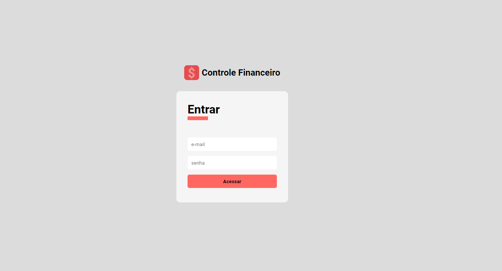
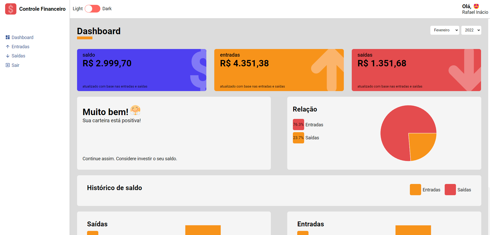
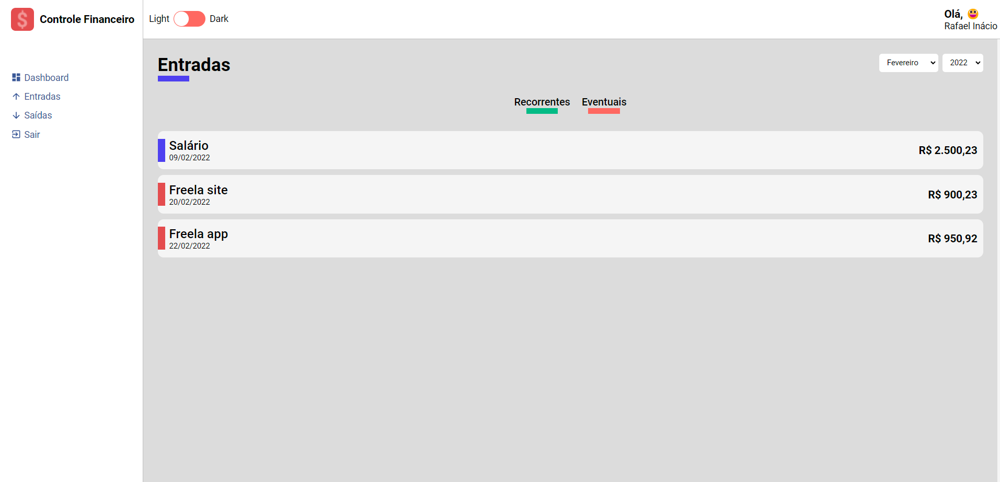
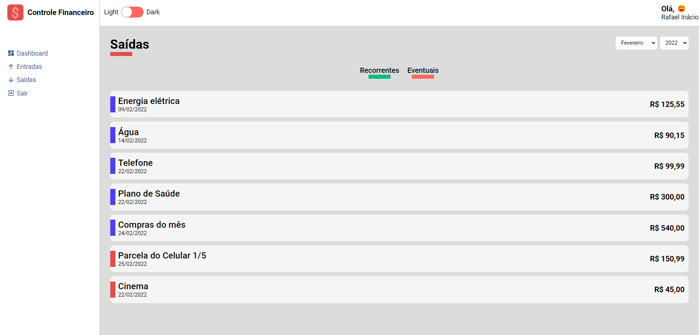

<h1 align="center">
    <a href="#">Controle Financeiro</a>
</h1>
<p align="center">🚀 A Dashboard for financial control</p>
<p align="center">
  
  
  
</p>

### Deploy and how to access the application

Access the application:

- Email: rafael@inacio.com
- Password: 123

* [Here](https://controle-financeiro-rafael.netlify.app/)






### 🛠 Technology

The following tools were used in the construction of the project:

- [Node.js](https://nodejs.org/en/)
- [React](https://pt-br.reactjs.org/)
- [TypeScript](https://www.typescriptlang.org/)


### Getting Started 🚀

#### Cloning

```ps
# Clone the repository using git
$ git clone https://github.com/rafaelinacioo/controle-financeiro.git
# Access the project folder
$ cd controle-financeiro
```

#### Requirements

- [Node.js](https://nodejs.org/en/)
- [Yarn](https://yarnpkg.com/) or [npm](https://www.npmjs.com/)

This project use third party dependencies that need to be installed, use that command to install all needed dependencies

```ps
$ yarn install
or
$ npm i
```

#### Running

To start the Server run the command

```ps
# Entering in directory
$ cd controle-financeiro
# Run the server
$ yarn start
or
$ npm run start
```

### License 📝

This project is under the MIT license. See the [LICENSE](https://github.com/rafaelinacioo/controle-financeiro/blob/master/LICENSE) for more information.